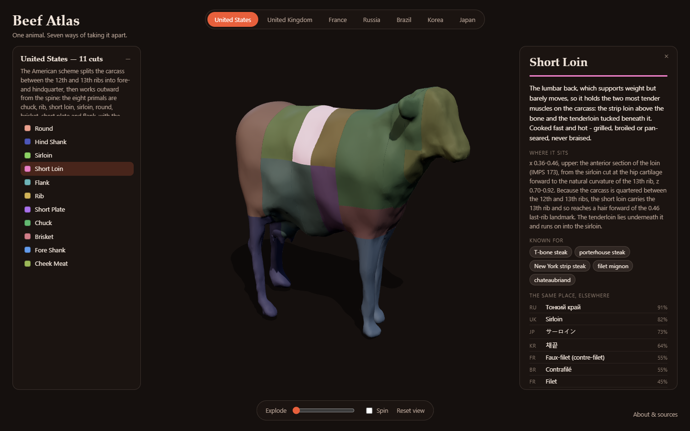
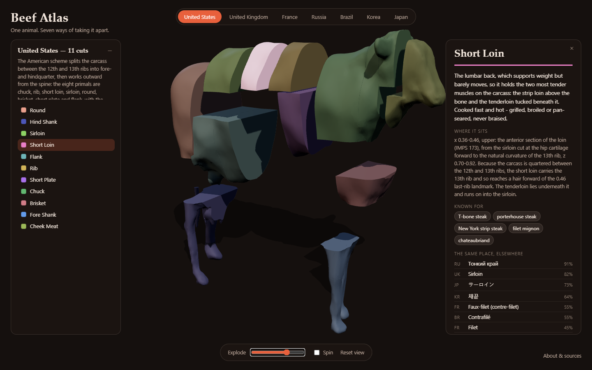
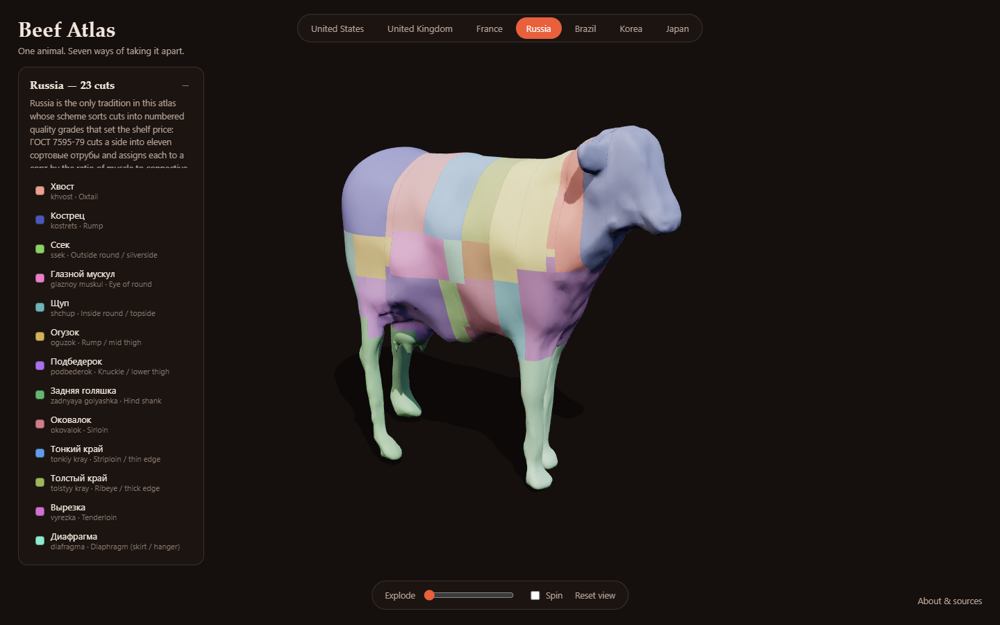
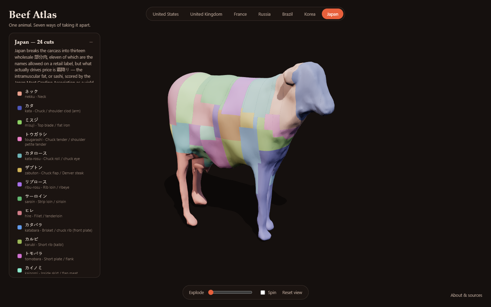

# Beef Atlas

**One animal. Seven ways of taking it apart.** An interactive 3D page showing how the
United States, the United Kingdom, France, Russia, Brazil, Korea and Japan divide the
same beef carcass — 153 named cuts drawn on one cow, so the traditions can be compared
directly rather than as seven unrelated charts.



### → **[Open the atlas](https://skfd.github.io/beef-atlas/)**

**[Read the writeup on how the six traditions differ →](docs/differences.md)**

Pick a cut and the panel tells you what the muscle does on the living animal, how it
is therefore cooked, what it is famous for — and, the part that makes it an atlas,
**which cuts occupy that same piece of animal everywhere else**. The US short loin is
91% Russian тонкий край, 82% the British sirloin, 73% Japanese サーロイン, 64% Korean 채끝.



## Running it

It is live at **<https://skfd.github.io/beef-atlas/>**, deployed from `web/` by
`.github/workflows/pages.yml` on every push to `main`.

To run it locally: the page is static, but it uses ES modules, which browsers refuse
to load over `file://`, so serve the `web/` folder rather than opening the file:

```sh
cd web && python -m http.server 8731 --bind 127.0.0.1
```

Then open <http://127.0.0.1:8731/>. `three.js` comes from a pinned CDN
(`three@0.186.0`), so the first load needs a network; the models are local.

## Rebuilding the models

Blender is a **portable extract** at `~/Tools/blender-4.5` — it is not on `PATH` and
was never installed machine-wide, so nothing needed a UAC prompt. Add it with
`setx PATH "%PATH%;%USERPROFILE%\Tools\blender-4.5"` if you want `blender` to just work.

```sh
python tools/check_data.py                                   # validate the cut data
~/Tools/blender-4.5/blender.exe -b --python blender/build.py -- --preview
node tools/shoot.js                                          # drive it in Chromium
```

The build takes about three and a half minutes for all seven traditions and writes `web/models/*.glb`,
`web/data/cultures.json` and `build/build_report.json`. `--only us` does one tradition;
`--preview` also renders Workbench PNGs into `build/preview/`.

`tools/shoot.js` loads the page in real Chromium, hovers and clicks a cut in the 3D
view, explodes the carcass and steps through every tradition, failing on any console
error. A 3D page nobody has rendered is not finished.

## Swapping the cow for a different model

The 130 cut rectangles are authored against the *frame*, not against a particular
mesh, so replacing the animal is a data-free operation:

```sh
blender -b --python blender/import_model.py -- --input your-cow.glb --keep-largest
blender -b --python blender/build.py --            # every tradition, re-carved
```

`import_model.py` reads glb/gltf/obj/fbx/stl/ply/blend, **detects** which way the
animal faces, scales it into the frame, welds it into one manifold shell and writes
`assets/cow_normalized.blend`, which `blender/cow.py` then uses instead of the
procedural cow. Delete that file to go back.

Orientation is detected rather than declared, because a wrong `--forward` flag
produces a cow lying on its side that still exports perfectly happily. For a
standing quadruped the bounding box settles it — longest axis is nose-to-tail,
shortest is across — and the signs have reliable tells: the centroid of a barrel on
thin legs sits above mid-height, and the muzzle end is much narrower than the
buttock. `--forward`/`--up` override it. `--keep-largest` throws away plinths,
ground planes and bystanders.

It then prints where the anatomy actually landed against the FRAME.md landmarks and
**refuses to bless a mesh that fails validation**, because a new model will not have
identical proportions and the cut data assumes those landmarks.

### Finding a model you can actually ship

This repo is public, so the licence has to permit redistribution — "free to
download" usually does not. What the search turned up:

| Source | Licence | Usable? |
|---|---|---|
| [Ungarisches Steppenrind](https://sketchfab.com/3d-models/ungarisches-steppenrind-6c6b19d0a86e472a968c4fbad8a45636), [Pinzgauer Stier](https://sketchfab.com/3d-models/pinzgauer-stier-b6053e511ceb40cc9096aa63f9eebe56) (noe-3d.at) | **CC0** | Scans of 1883 stone bull *statues* in Vienna — sculptural proportions, and the first includes a herdsman. Use `--keep-largest`. |
| [Realistic Holstein Cow](https://sketchfab.com/3d-models/realistic-holstein-cow-game-ready-asset-0bd2f1c0c79a4b5b9d36e67f0f700c5e) (3Dima) | **CC-BY** | 13k faces, game-ready, standing. Best shape match; needs attribution. |
| Poly Pizza, Quaternius, Kenney | CC0 / CC-BY | Stylised low-poly — a downgrade on the procedural cow. |
| TurboSquid / CGTrader / Free3D "free" | Personal-use | **Not redistributable.** Avoid. |

Sketchfab requires a signed-in account to download (the API returns 401 to
anonymous callers), so grabbing one is a browser job. Download it, run the two
commands above, and record the model and its licence in this README plus the page's
About panel if it is CC-BY.

## How it is put together

| Path | What it is |
|---|---|
| `data/FRAME.md` | The normalized cow frame. **Read this first.** |
| `data/cuts_*.json` | One tradition each: names, anatomy, cooking, dishes, sources. |
| `blender/cow.py` | Loads `assets/`, or builds a lofted profile cow if it is absent. |
| `blender/import_model.py` | Fits a downloaded model into the frame, replacing the above. |
| `blender/cuts.py` | Turns hand-drawn rectangles into a true partition of the body. |
| `blender/build.py` | Carves each tradition and exports one GLB per tradition. |
| `web/` | The page. `app.js` is three.js; there is no build step. |
| `tools/` | Data checks, the web data fold-up, the browser test. |

Every cut is expressed as a rectangle in one shared frame — `x` from tail to nose,
`z` from ground to withers — so the *same numbers mean the same place* in all seven
traditions. That shared frame is the whole trick; without it, comparing schemes is
guesswork.

`blender/cuts.py` then resolves those rectangles into a partition before anything is
carved. Rectangle edges become grid lines; the smallest rectangle covering a cell wins
it, so a named subcut (ミスジ, 차돌박이, araignée) beats the primal it sits inside; a
cell inside no rectangle goes to the nearest one, so the legs and head land somewhere
instead of vanishing; and the cells are merged back into as few boxes as possible,
because each one costs a boolean against the whole cow. The result tiles the animal
exactly once — which is what makes per-cut picking and the exploded view work.





## Adding a tradition

1. Write `data/cuts_xx.json` against the schema in the existing files, with every
   rectangle in the frame of `data/FRAME.md`. Cite the URLs you actually fetched.
2. `python tools/check_data.py`
3. Rebuild. Add `xx` to the display order in `tools/make_web_data.py`.

No code changes are needed — the page builds its tabs, legend and cross-references
from the data.

## Honest simplifications

- **Boundaries are axis-aligned blocks.** Real charts have some diagonal and
  seam-following lines. Most beef boundaries genuinely are straight cuts, so this is
  closer than it sounds, but it is an approximation.
- **Thin sheets are carved full width.** Skirt, hanger, flank and the like are sheets
  of muscle, not blocks; carving them true-to-life would make them invisible. The
  panel says so on every cut where it applies.
- **Muscles that differ only left-to-right cannot be separated**, because a cut is a
  rectangle in the side view. French *poire*/*merlan* and the Brazilian round muscles
  are tiled front-to-back instead; the cut descriptions say where they really sit.
- **The cow is a European type, with no hump.** Brazilian *cupim* is the fatty hump of
  zebu cattle; its shape marks the spot but the hump itself is missing, and the panel
  says so.
- **The mesh is stylised**, not an anatomical model. It is built to be recognisable
  and to have the right proportions, not to be a reference animal.

## Two Blender traps, in case they bite again

Both are in `blender/cow.py`'s docstring, and both cost real time here:

- **Metaball resolution and remesh voxel size are absolute lengths.** A cow one unit
  long silently tessellates to an *empty mesh* rather than erroring. Everything is
  built at `SCALE = 10` and shrunk at the end.
- **Metaball fields sum.** Lobes dense enough not to scallop the silhouette balloon
  it; lobes sparse enough to hold it scallop. That is why the body is a loft and not
  metaballs, which was the obvious first choice and the wrong one.

## Attribution and sources

The cow is **["Cow" by nandakishor.irnv](https://sketchfab.com/3d-models/cow-14e616e26823472c809a03042a94b990)**,
used under **[CC BY 4.0](https://creativecommons.org/licenses/by/4.0/)** and modified
(fitted to the frame, made watertight, decimated, carved). See [ATTRIBUTION.md](ATTRIBUTION.md).

Every tradition's data carries the URLs that were actually fetched for it, listed
under **About & sources** in the page and in the `sources` array of each JSON file.
Wikipedia's "Cut of beef" and its per-country counterparts are the backbone, with
USDA IMPS Series 100, AHDB, la-viande.fr, scotconsultoria, 축산물품질평가원 and the
Japan Meat Grading Association behind the individual schemes.
